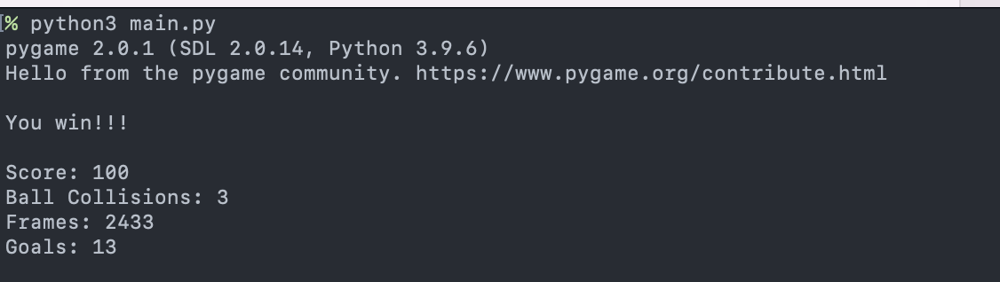

# Soccer Simulator

A small game that allows two players to get goals to win!

## Contents
 - [Requirements](#requirements)
   - [Modules](#modules)
 - [How to Play](#how-to-play)
 - [Screenshots](#screenshots)
 - [About](#about)

## Requirements

This game requires Python 3.X and was built with Python 3.9. It is possible to play on any machine running Python; macOS, Windows, and Linux are all supported.

### Modules

Modules required to run this program are:

- `time` (builtin with Python 3)
- `pygame` (installable via command line with `python3 -m pip3 install pygame`)
- `pgzrun` (installable via command line with `python3 -m pip3 install pgzrun`)

## How to Play

Start the game from a command-line interface:

`$ python3 main.py`

Then, Player 1 can use the arrow keys (up, down, left, and right) to move their soccer ball. Player 2 can use WASD to move their soccer ball.

If the balls collide, there is a 10 point penalty. Getting to -100 points loses the game.

If Player 2's ball goes into Player 1's Goal, the score increases by 10 points. If Player 1's ball goes into Player 2's Goal, the score also increases by 10 points. Getting to 100 points wins the game.

## Screenshots

Gameplay of Soccer Simulator.

A game loss.

A win.

## About

This program was created by [Peter Nielsen](https://github.com/peternielsen112). Find him on [Github Pages](https://peternielsen112.github.io).